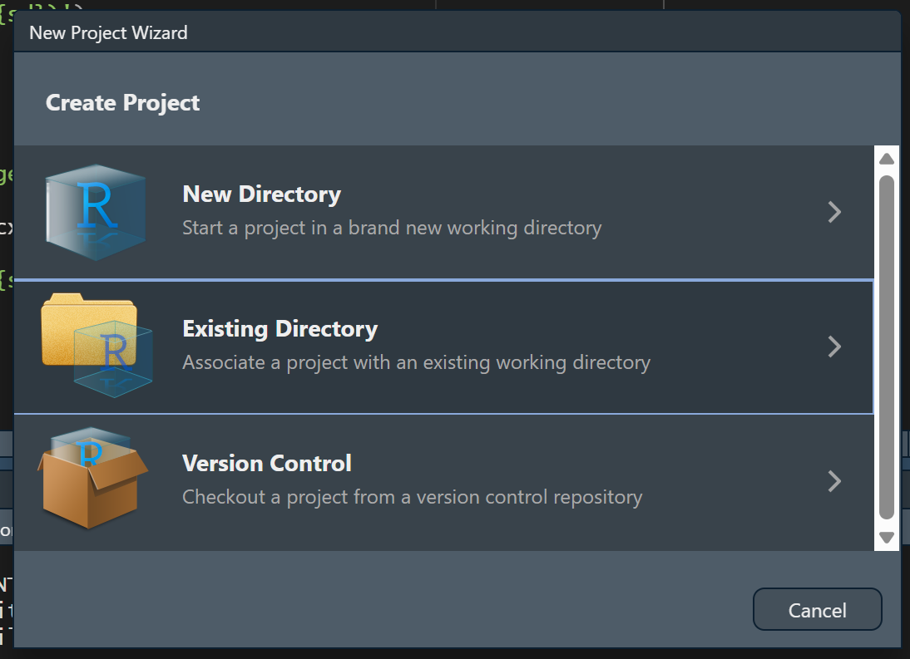

# R and R Studio (Week 4) {#sec-04-prep1}

We all know how to work with a spreadsheet, but a spreadsheet is not the best way to record, manage, and analyse data. A copy-and-paste error in an Excel-based model contributed to JPMorgan Chase's \$6 billion loss in 2012. Public Health England failed to log over 15,000 positive coronavirus test results in 2020, because they used an older Excel format template. A spreadsheet is useful for looking at data and for some simple calculations, but it isn't designed for reproducible work: the work done in one doesn't normally get tracked, and there's no way to tell what has been done to a file just by looking at it. Statistical software like R can take information from spreadsheets and handles it in a different way, keeping a clearer record and making the process more reproducible, which is why public health and statistics use it for data management and analysis. We will examine how to properly interact with R and RStudio, and use it to build an example clinic record.

You need to save R, RStudio and your clinic record on your computer, so first you will work on an installation and setting up a project folder. After that, the chapter is mostly about learning R's vocabulary: objects hold values, values have types, functions act on them, and an error message tells us which of the three we got wrong. Running underneath all of it is one habit that matters more than any of the vocabulary. A saved script can be run again; a line typed into the console is lost and cannot be run again. Reproducibility, replicability and transparancy are key scientific principles: saving scripts is a method for us to make sure our public health science adheres to these principles. Everything we learn goes into a small clinic visit log, built one column at a time until it's a dataset we can ask questions of. Nothing in this chapter is statistics yet; all of it is learning the language we will use to run statistics.

## Chapter intended learning outcomes

By the end of this chapter you will be able to:

1.  Install R and RStudio on your own device, and verify the installation by running code and loading a package
2.  Use an RStudio Project and a saved script, and justify scripting instead of working in the console
3.  Assign values to objects, and identify R's basic data types and structures (numeric, character, logical, factor, vector, data frame)
4.  Call a function using named arguments, explain what a default value is, and find its help page
5.  Write and read a short piped sequence that includes a logical condition and extracts a column from a data frame using `$` and `dplyr`'s `select()`
6.  Diagnose a failed line of code from its error message
7.  Build a project folder, following sensible file and folder naming conventions

## Setup

There's no data to read yet, so there's nothing to set up in this chapter.

```{r}
#| label: setup-hidden
#| include: false
options(width = 76)
```

## Installing R and RStudio

R is the programming language itself, and is the software program that actually runs our code. RStudio is a separate, free program that sits on top of R and makes it nicer to work in: a proper editor, a console, and the panes we look at next. Install R first, then RStudio, in that order. We can use R without RStudio, though it's harder for a beginner.

**Installing R.** Go to <https://cran.r-project.org> and choose the download link for your operating system, 'Download R for Windows' or 'Download R for macOS.' For most people, you can run the installer and accept every default option.

**Installing RStudio.** Go to <https://posit.co/download/rstudio-desktop/> and download the free RStudio Desktop installer for your operating system. Run it the same way, accepting the defaults throughout.

**Verification.** Once installed, check it is working properly. Open RStudio, type `2 + 2` into the console, the panel where typed commands run, covered properly in a moment, and press Enter. You should see `[1] 4`. Then confirm a package installs and loads too: run `install.packages('dplyr')` once, then `library(dplyr)`. Both get a proper explanation later in this chapter, under Packages; for now, just check that neither throws an error. If anything here fails, get it fixed before going on, since nothing later in this chapter works without it.

## Finding our way around RStudio

### The four panes

RStudio's window is split into four panes, and where each one sits stays consistent no matter what we're doing.

-   **Top-left: the source pane.** This only shows when a script is open, so it likely won't appear in RStudio fresh out of the box. Click File > New File > R Script and the pane should appear like in the image below.  This is where we write and save scripts, the `.R` files that keep a record of all the statistics we ask R to conduct.  Code typed here doesn't run on its own; we have to tell RStudio to run it, which we cover in section 1.4.4.
-   **Bottom-left: the console.** This is where code actually executes, one line at a time, and where its output appears. We can type directly into the console, but anything typed there is gone once RStudio closes. We can use the console to test if a line of code works (and check whether we want to keep it or change it), we use the source pane to keep a record of the code we want to keep.
-   **Top-right: the environment pane.** This lists every object that currently exists in our R session, its type, and a preview of its contents. Every time we create something, it appears here. When something we expected to see isn't listed, that's usually the first clue something went wrong.
-   **Bottom-right: a tabbed pane.** This holds the file browser, the plot viewer, the list of installed packages, and the help viewer, one tab each.

{fig-alt='An RStudio window with the four panes labelled: source, console, environment, and a tabbed files/plots/packages/help pane.' width='95%' fig-align='center'}

### Building a project folder

Working with R means managing at least a couple of files, most likely some data files and some R script files. It is usually a good idea to put them into a "project folder". Pick somewhere sensible on your machine, for example inside Documents. Create a new folder there and give it a short, sensible name, for example `ies_mph`. We will follow a format for naming all files and folders in this course from here on. These naming conventions helps ensure the names can be easily read by computers, and reduces errors in how humans write the code. The conventions are: no spaces, no `&`, `#`, or `%`, consistent case, and a date written as `YYYY-MM-DD`. This date format ensures files are listed in chronological order when sorted by filename. Inside the folder you've created, create three subfolders: `data`, for anything you read in; `scripts`, for the `.R` files you write; and `outputs`, for anything you save out, a plot or a table. Keeping these three separate means you always know where to look for something later, in this course and beyond it. This folder structure isn't compulsory, just a suggestion. We'd still recommend sticking with it throughout the course, just to build the habit. Once you're more familiar with R and RStudio, feel free to work with whatever folder structure works for you. Some employers - particularly in sectors like data science - have their own naming conventions and folder structures, so it's good professional practice to get used to following coding conventions and structures. 

### Creating an RStudio Project

An RStudio Project turns your folder into something RStudio understands directly. RStudio will consider all folders and files relative to the specific project folder, rather than all the folders on the computer. This allows you to navigate to files using relative paths rather than having to type a full path every time (we will cover this later) and is also helpful when working across multiple projects, and when working as part of a team of analysts on a project.

1.  In RStudio's menu, go to **File → New Project...**
2.  Choose **Existing Directory**, since the folder already exists.
3.  Browse to the project folder you just built, and click **Create Project**.
4.  RStudio reopens with that folder as the **working directory**. You can confirm this by checking the Files pane, bottom-right, which now shows the folder's contents, and the title bar, which now shows the project's name.

{fig-alt="RStudio's New Project wizard, showing New Directory, Existing Directory, and Version Control, with Existing Directory highlighted." width='70%' fig-align='center'}

A Project's working directory is the folder R treats as 'here' when it looks for a file. Once we start reading data in Chapter 2, this is what lets a path like `data/mph_nhanes_20241107.csv` work on any machine, no matter where the project folder actually sits on that machine's disk.

### Console versus script

We can type a line directly into the console and press Enter, and it runs immediately. That's fine for a quick check, but it isn't saved anywhere. Close RStudio, and it's gone.

For anything worth keeping, we write it in a script in the source pane instead, then run it from there:

-   **Ctrl+Enter** (Windows) or **Cmd+Return** (Mac) runs the single line the cursor is on, or a selected block of lines, and sends it to the console.
-   Highlighting several lines and pressing the same shortcut runs all of them in order.
-   The **Source** button, top-right of the source pane, runs the entire script from top to bottom.

The reason this course insists on scripts instead of the console is simple: we will need to do this again, and we won't remember exactly what we typed. A saved script is a record anyone can rerun from scratch and get the same result, which is why every exercise in this book asks for a script instead of console work.

## The log we're going to build

From here on, every section in this chapter adds one real piece to a small dataset: a toy clinic visit log for four patients. By the end of the chapter we'll have this:

| patient_id | age | smoker | weight_kg | chol |
|------------|-----|--------|-----------|------|
| P01        | 34  | No     | 72        | 5.2  |
| P02        | 61  | Yes    | 88        | 6.1  |
| P03        | 45  | No     | 65        | NA   |
| P04        | 29  | Yes    | 59        | 4.8  |

Four patients, four pieces of information about each. Using R's language: Assignment gives us one value. A vector strings several values into one column. A data frame lines several columns up side by side, and the table above shows a data frame. Every section that follows explains the terminology used in R, and builds one more piece of the table in R, for real, rather than a table drawn on a page or typed into a spreadsheet.

## Objects and assignment

In R, objects are pieces of information that R uses to perform statistics or data manipulation. You must give each object in your project a unique name, and when you define what information appears in an object, we refer to that as assignment. Storing information in objects means we can use it again later without retyping it, and build on it later in the project workflow rather than starting over. R creates and assigns values to objects  with the arrow and line symbol `<-`. A keyboard shortcut for typing is **Alt+-** or **Option+-**. The name of the object appears to the left of the arrow, and the information we want to place in the object appears at the other end of the arrow. Patient P01 is 34 years old:

```{r}
#| label: assignment-demo
age <- 34
age
```

`age` now holds the value 34. It appears in the Environment pane, top right, and stays there for the rest of the session, or until we overwrite it by assigning something else to the same name.

<!-- This is confusing for someone totally new, suggest deleting until commands like round are introduced.
`=` looks similar, but does a different job. Inside the parentheses of a function call, `=` doesn't create an object at all. It names which argument of the function a value belongs to: -->

```{r}
#| label: equals-demo
round(x = 3.14159, digits = 2)
```

<!-- Here, `x = 3.14159` doesn't create an object called `x`. It tells `round()` that 3.14159 is the value for its `x` argument. Outside a function call, `=` can actually be used for assignment too, the same way `<-` can. This course always writes `<-` for assignment and keeps `=` for naming arguments inside a function call, so the two jobs stay visually distinct rather than looking identical on the page. -->

## Vectors and a first look at data frames

Most of what we do with data in this course means handling many values of the same variable at once, everyone's age in a sample, say, not just one person's. `c()` combines several values into one object like that, called a **vector**. The single `age` we assigned a moment ago only records one patient; the log needs all four. The code below combines all four ages and assigns the result to `age`, overwriting the single value from before, exactly the way the Objects and assignment section said an object could be overwritten:

```{r}
#| label: vector-demo
age <- c(34, 61, 45, 29)
age
```

A vector holds one type of value, several at once, so it's one variable, like `age` above. A **data frame** holds several vectors side by side, as columns, which is exactly what a real dataset is: one column per variable, lined up so row one is always the same person throughout. This is the structure this course actually works with from the next chapter onward. The code below builds the start of our log from three vectors: `age`, from above, a new `patient_id` vector naming each patient, and a new `smoker` vector.

```{r}
#| label: dataframe-preview
patient_id <- c('P01', 'P02', 'P03', 'P04')
smoker <- c('No', 'Yes', 'No', 'Yes')
visits <- data.frame(patient_id, age, smoker)
visits
```

Note that all three vectors have to have the same length of data (4 values each), otherwise R will complain when we create a data frame. That's not a technicality either: it's the same thing that would go wrong with a real log if we recorded an age for a fifth patient we never gave an ID to.

## Data types

R keeps track of what kind of value an object holds, and it matters: R decides what it will let us do with a value based on its type, for example refusing to calculate a mean for text. Knowing a column's type is knowing what's possible on it. `class()` reports it, and our own log is the fastest way to see two of the four:

```{r}
#| label: class-demo
class(visits$age)
class(visits$smoker)
class(TRUE)
class(factor(c('Yes', 'No')))
```

Four types matter throughout this course:

-   **numeric**: a number, like the ages in `visits`
-   **character**: text, like `visits$smoker` right now, always in quotes
-   **logical**: `TRUE` or `FALSE`
-   **factor**: a set of categories. It looks like text but is stored with a fixed, known list of possible categories behind it. `visits$smoker` is a natural candidate for exactly that, though we leave it as character for now. Chapter 3 turns six columns of `nhanes_mph` into proper factors, exactly this way, against the dictionary file.

## Functions and arguments

Nearly everything we do in R, from here to the last chapter, is calling a function, so we look at the shape of one properly now. A function is a machine that takes some input, processes it, and produces some output. Our log needs one more column: what each patient weighed on the clinic scale, in kilograms, before rounding. P01's reading was 71.83 kg. In the example below, `round()` takes that reading and rounds it to a specific precision, whole kilograms, which is the precision we actually want in the log. Note that a function is always followed by a pair of parentheses `()`.

A function takes different **arguments**, basically the inputs the machine runs on. A function's arguments can be matched two ways: by **position**, in the order the function expects them, or by **name**, in any order at all.

```{r}
#| label: positional-named
round(71.83, 0)
round(71.83, digits = 0)
round(digits = 0, x = 71.83)
```

All three lines return the same result. The first matches purely by position: `round()`'s first argument is `x`, its second is `digits`. The second and third name `digits` explicitly, so its position in the call no longer matters, which is why the third line can put `digits` before `x` without changing the answer.

The examples above simply run the function, so the output is shown in the console. If we're going to reuse the output later, we'll have to save it, the same way as the assignment above. All four patients' scale readings, rounded the same way, become our log's weight column:

```{r}
#| label: function-assignment
scale_kg <- c(71.83, 88.42, 65.06, 58.57)
weight_kg <- round(scale_kg, digits = 0)
weight_kg
visits <- data.frame(visits, weight_kg)
visits
```

Some arguments have a **default**: a value the function uses automatically if we don't supply one. P03's bloods were never taken, so her cholesterol reading is missing:

```{r}
#| label: default-arg-demo
chol <- c(5.2, 6.1, NA, 4.8)
mean(chol)
mean(chol, na.rm = TRUE)
```

`chol` has one missing value, `NA`, for P03. `mean()`'s `na.rm` argument defaults to `FALSE`, so by default a single missing value makes the whole result `NA`, exactly as the first line shows. Setting `na.rm = TRUE` tells `mean()` to drop that one missing value first, then average the three that remain. We'll meet `na.rm` constantly from here on, and it always means exactly this: drop the missing values before calculating, and be clear about how many were dropped. `chol` joins the log the same way `weight_kg` just did:

```{r}
#| label: add-chol
visits <- data.frame(visits, chol)
visits
```

## Comparison and logical operators

These build a condition that's either `TRUE` or `FALSE` for each value in a vector, which is what every `filter()` from Chapter 3 onward runs on:

```{r}
#| label: comparison-demo
visits$age > 50
visits$age == 34
visits$age != 34
```

`!` negates a condition, `&` combines two conditions and requires both to be true, `|` combines two conditions and requires either one to be true, and `%in%` tests whether each value appears anywhere in a set:

```{r}
#| label: logical-demo
!(visits$age > 50)
visits$age > 50 & visits$smoker == 'Yes'
visits$age > 80 | visits$age < 30
visits$age %in% c(34, 45)
```

One patient, P02, is both over 50 and a smoker.

## Packages

Everything used so far, `c()`, `class()`, `round()`, `mean()`, comes built into R itself. Most of what this course does lives in add-on packages instead: `dplyr` for manipulating data, `ggplot2` for plotting, and others still to come. Getting a package ready to use is two separate actions. **Installing** downloads it onto this computer, once. **Loading**, with `library()`, makes its functions available in the current R session, and has to be done again every time we start a fresh session, even though we never need to install the same package twice.

Installing is typically a one-off, run in the console and not saved in a script: `install.packages('dplyr')`. Loading is what actually goes in a script, since every script that uses `dplyr` needs it loaded first:

```{r}
#| label: load-dplyr
#| message: false
library(dplyr)
```

Loading a package sometimes prints a short message, often about functions it's replacing from another package. It's suppressed here since it doesn't matter yet. Later in the course it will, for a specific reason.

That message points at a real ambiguity: once two loaded packages both define a function with the same name, R has to pick one, and it's not always the one we meant. `package::function()` sidesteps the whole problem. Writing `dplyr::select()` instead of just `select()` calls `select()` from `dplyr` directly, by name, whichever packages happen to be loaded, and without needing `library()` to have loaded that package first at all. We'll use this notation in prose from here on whenever it helps to be explicit about which package a function comes from.

## `$` versus `select()`

`$` pulls a single column out of a data frame, as a plain vector:

```{r}
#| label: dollar-demo
visits$smoker
```

`select()`, from `dplyr`, keeps a column too, but keeps it inside a data frame:

```{r}
#| label: select-demo
select(visits, smoker)
```

The values are the same either way. The difference is the container. `visits$smoker` is four bare values with nothing else attached. `select(visits, smoker)` is still a data frame, one column wide, four rows long. This matters practically from Chapter 4 onward: some functions, like `t.test()`, want a bare vector and expect `$`. Most of `dplyr`, starting in Chapter 3, works on data frames throughout and expects `select()`.

## Quoting rules and backticks

Text values need quotes. Numbers, `TRUE`/`FALSE`, and the names of objects or columns don't. Our own log makes the point directly: patient IDs are text and need quotes; ages don't.

```{r}
#| label: quoting-demo
class('P01')
class(34)
```

`'P01'` is text. `34` is a number, and `class()` treats them completely differently. The same logic applies to object and column names: writing `age` refers to the vector we created earlier, but writing `'age'` is just the three-letter word.

A column name containing a space needs a different kind of quoting mark entirely: backticks, not quotation marks.

```{r}
#| label: backtick-demo
toy <- data.frame(`patient id` = c(1, 2, 3), check.names = FALSE)
toy$`patient id`
```

Backticks aren't easy to work with, and generally it's not recommended to have variable names containing a space. `data.frame()` normally cleans up column names automatically, turning a space into a dot. `check.names = FALSE` switches that off, purely so this example can show a genuine spaced name. When we read a CSV file with `read_csv()` in Chapter 2, column names come in exactly as written, spaces and all, with no automatic cleanup. Its dictionary file has a column literally called `Variable names`, and backticks are exactly how we'll refer to it.

## The pipe

Some R code can be difficult to understand. For instance `round(mean(visits$chol, na.rm = TRUE), digits = 1)` can be quite complex for a new R user. This is mainly because there are two functions in that line, one enclosing another. If you want to decipher code like this, the best way would be to break it down one function at a time, starting from the most central part.

One way to write more understandable code is by using the pipe `|>`. It takes what's on its left and feeds it in as the first input to what's on its right. Read it aloud as 'and then':

```{r}
#| label: pipe-demo
visits$chol |> mean(na.rm = TRUE) |> round(digits = 1)
```

Take the data's cholesterol column, and then average it, dropping the one missing value, and then round the answer to one decimal place. The pipe exists so a sequence of steps can be read in the order they actually happen, which is how every multi-step `dplyr` sequence in this book, starting in Chapter 3, is written.

There is a keyboard shortcut for the pipe: **Ctrl+Shift+M** (Windows) or **Cmd+Shift+M** (Mac). We'll write a lot of pipes over the rest of this course, so it'd be useful to memorise this shortcut.

If we see other people's code, we may find `%>%`, the older pipe, which is only available once we've loaded the `dplyr` package. Practically, both pipes can be treated the same.

## Reading errors

The errors below are R telling us our *code* is wrong: a typo, a missing bracket, the wrong function name. That's a different job from checking whether the *data* are wrong, which is Chapter 2's problem once we're reading in a real file rather than typing values ourselves. Even a very experienced R user encounters errors constantly. The skill is reading what the message says, not reacting to the fact that something went wrong. R usually formats errors as a short heading followed by a line starting with `!` stating what went wrong. Five kinds of failure account for nearly everything we'll see in this course.

**Object not found.** R can't find something by that name, usually a typo or a variable that was never created:

```{r}
#| label: err-object-not-found
#| error: true
mean(agee)
```

```{r}
#| label: fix-object-not-found
mean(age)
```

**Could not find function.** Same idea, but for a function name. R is case-sensitive throughout, so `Mean()` is not the same thing as `mean()`:

```{r}
#| label: err-function-not-found
#| error: true
Mean(age)
```

```{r}
#| label: fix-function-not-found
mean(age)
```

**Unexpected symbol.** R's interpreter (the machine that reads our code and executes it) found something it couldn't make sense of, usually a missing operator or a missing comma between two things that were meant to be one call:

```{r}
#| label: err-unexpected-symbol
#| error: true
c(34, 61) c(45, 29)
```

```{r}
#| label: fix-unexpected-symbol
c(34, 61, 45, 29)
```

Notice the fix is just `age` written out longhand: a missing comma between two calls that were meant to be one is exactly the mistake that would have split our own age vector in two.

**Unexpected end of input.** A bracket was opened and never closed, so R keeps waiting for the rest of the expression that never arrives. In the console this shows up as a `+` prompt instead of the usual `>`, waiting for us to finish the line; here, where the code has to run to completion on its own, it shows as an error instead:

```{r}
#| label: err-missing-bracket
#| error: true
sum(weight_kg
```

```{r}
#| label: fix-missing-bracket
sum(weight_kg)
```

**File does not exist.** R can't find a file at the path given, usually a typo in the file name or a path built from the wrong folder:

```{r}
#| label: err-file-not-found
#| error: true
read.csv('nonexistent_file.csv')
```

The warning line above states the actual reason, a missing file, before the error itself. We'll meet this one properly in Chapter 2, once there's a real file to read, the clinic's own version of the log we've just spent this chapter building by hand. `read.csv()` is base R's own version of the function; from there onward we use `read_csv()` from the `readr` package instead, which behaves a little differently but fails the same way when a path is wrong.

## Getting help

Every function used in this course has a help page. Typing `?mean` in the console and pressing Enter opens `mean()`'s help page in the Help pane, bottom-right, showing exactly what arguments it takes and what it returns. It's usually faster than searching online, and it's always correct for the version of R actually installed. RStudio also keeps a set of cheat sheets under **Help → Cheatsheets**, one per major package. Beyond that, this book itself stays the main reference for the rest of the course.

## The finished log

Four sections ago we had nothing but an idea for a table. Here's what we've actually built, one piece at a time: patient IDs, ages, smoking status, rounded weights, and cholesterol.

```{r}
#| label: worked-print
visits
```

We can check what type each piece is, exactly the way the Data types section did partway through:

```{r}
#| label: worked-class
class(visits)
class(visits$age)
class(visits$smoker)
```

Pull out one column as a bare vector, and build a logical condition on it, the same as the Comparison section did:

```{r}
#| label: worked-dollar-logical
visits$age
visits$age > 50 & visits$smoker == 'Yes'
```

One of the four patients, P02, is a smoker over 50. Compare `$` against `select()` on the same data frame:

```{r}
#| label: worked-select
visits$smoker
select(visits, smoker)
```

Same values, different container: a bare vector from `$`, a one-column data frame from `select()`. Chain two steps on it with the pipe, the same calculation the pipe section ran a moment ago:

```{r}
#| label: worked-pipe
visits$chol |> mean(na.rm = TRUE) |> round(digits = 1)
```

### Saving the log

Everything in `visits` only exists inside this R session, in memory. Close RStudio without saving it out, and it's gone, the same way a value typed straight into the console disappeared the moment we moved on. `write.csv()`, from base R, does the opposite of `read.csv()` from the Reading errors section above: it takes an object and a file path, and writes the object out as a real CSV file on disk.

```{r}
#| label: write-csv
write.csv(visits, 'visits.csv', row.names = FALSE)
```

Left out, `write.csv()` adds an extra column at the front of the file, numbering the rows 1 to 4. That's not part of our data, just R's own internal row labels leaking into the file, and it would show up as a stray, unlabelled column the moment the file is opened. `FALSE` tells `write.csv()` to leave it out and write only the columns we actually built.

That line just wrote a real file, `visits.csv`, sitting on disk the moment this page rendered, independent of R and of this book. In our own project, following the `data`/`scripts`/`outputs` structure from earlier in this chapter, this is what the `outputs` subfolder is for: a file we saved out, not one we're about to read back in. Opening it, in a spreadsheet application or a plain text editor, shows exactly what `visits` held in R: patient IDs, ages, smoking status, weight, and cholesterol, one row per patient, values separated by commas, no formatting or formulas hidden behind them. Chapter 2 explains why that matters, the moment we start reading files back in instead of writing them out.

Every idea used to build this log, a vector, a data frame, `$`, a comparison, loading a package, the pipe, comes back constantly from Chapter 2 onward. Only the data changes: Chapter 2 brings in this same clinic's real log, all eight patients, exactly as messily kept as real logs actually are.

## Exercises

**Exercise 1** (ILO 3). Create a vector called `height_cm` holding the values of 177, 155, 168, 181, using `c()` and `<-`. Check its class with `class()`, and confirm `height_cm` appears in the Environment pane after you run your code.

**Exercise 2** (ILOs 4, 5). Using `visits$chol`, round the values to the nearest whole number, naming the `digits` argument explicitly rather than relying on position. Then build a logical condition that identifies which patients have a cholesterol reading above 5 and are smokers, combining a comparison operator with `&`.

Then open `round()`'s help page by typing `?round` in the console. Find the **Usage** section at the top, and write down what value `digits` takes when you don't supply one. Check your answer by running `round()` on the same values with the `digits` argument left out entirely.

**Exercise 3** (ILOs 4, 5). Update the data frame `visits` to include the new `height_cm` variable. Calculate the BMI (weight in kg divided by height in metres, squared) of all the patients by using the `$` sign.

**Exercise 4** (ILO 5). Write a piped sequence, using `|>`, that takes `visits$age`, finds its mean, and rounds the result to zero decimal places. Then use `select()` to keep just `patient_id` and `smoker` from `visits`, and write one sentence stating how the result differs from `visits$smoker`.

## Self-check

A short multiple-choice check, not a writing exercise. There's no statistical result yet to interpret in a sentence. That starts in Chapter 3. Instead, these five questions target the places students most often get tripped up in R's syntax. Answers are in the Solutions callout below.

**1.** In `mean_x <- mean(x, na.rm = TRUE)`, what's the difference between `<-` and `=`?

a)  They mean exactly the same thing
b)  `<-` creates or updates an object; `=` here only names an argument inside the function call
c)  `<-` only works inside a function call, `=` only works outside one
d)  `=` creates an object; `<-` only names an argument

**2.** `visits$smoker` and `select(visits, smoker)` return the same four values. What actually differs between them?

a)  Nothing, they always return identical output
b)  `$` only works on vectors, never on data frames
c)  `$` returns a bare vector; `select()` returns a data frame with one column
d)  `select()` is base R; `$` is from `dplyr`

**3.** In `round(x = 3.14159, digits = 2)`, what happens if you write `round(digits = 2, x = 3.14159)` instead?

a)  Nothing changes: named arguments can be given in any order
b)  R throws an error, because the arguments are in the wrong order
c)  R silently ignores `digits` and uses its default instead
d)  It only works if `x` is written first, always

**4.** Why does R separate `install.packages()` from `library()`?

a)  They do the same thing; `install.packages()` is just the older name for it
b)  `install.packages()` downloads a package once; `library()` loads it into the current session, and has to be run again every time R restarts
c)  `library()` downloads the package; `install.packages()` only loads it
d)  Both have to be run every single time you use a function from a package

**5.** Running `Mean(age)` produces `Error in Mean(age) : could not find function 'Mean'`. What's actually wrong?

a)  The object `age` doesn't exist
b)  R is case-sensitive and there's no function called `Mean`; the function is `mean()`
c)  A package needs to be installed first
d)  There's a missing comma somewhere in the call

::: {.callout-note collapse='true'}
## Solutions

**Exercise 1**

```{r}
#| label: sol-ex1
height_cm <- c(177, 155, 168, 181)
height_cm
class(height_cm)
```

**Exercise 2**

```{r}
#| label: sol-ex2
round(visits$chol, digits = 0)
visits$chol > 5 & visits$smoker == 'Yes'
```

`?round`'s Usage section reads `round(x, digits = 0)`, so `digits` defaults to 0: leave it out and R rounds to the nearest whole number. Running it both ways confirms that:

```{r}
#| label: sol-ex2-default
round(visits$chol)
round(visits$chol, digits = 0)
```

The two lines give identical results, which is what a default argument means in practice. The help page is the fastest way to find out what a function does when we don't tell it, and it's always right for the version of R we actually have installed.

**Exercise 3**

```{r}
#| label: sol-ex3
visits <- data.frame(visits, height_cm)
bmi <- visits$weight_kg / (visits$height_cm / 100)^2
bmi
```

**Exercise 4**

```{r}
#| label: sol-ex4
visits$age |> mean() |> round(digits = 0)
select(visits, patient_id, smoker)
```

`select(visits, patient_id, smoker)` returns a data frame with two columns and four rows. `visits$smoker` returns just the smoker column, on its own, as a bare vector with no `patient_id` alongside it and no data frame structure around it.

**Self-check answers**

1.  **b.** `<-` creates or updates an object. `=` inside a function call only names which argument a value belongs to; it never creates an object there.
2.  **c.** Same values, different container: `$` strips the data frame away and leaves a bare vector, `select()` keeps the data frame structure.
3.  **a.** Named arguments are matched by name, not position, so their order in the call makes no difference to the result.
4.  **b.** Installing is a one-off download. Loading has to happen at the start of every R session, since a fresh session starts with no packages loaded, even ones already installed.
5.  **b.** R is case-sensitive throughout. `Mean` and `mean` are different names as far as R is concerned, and only one of them is a real function.
:::